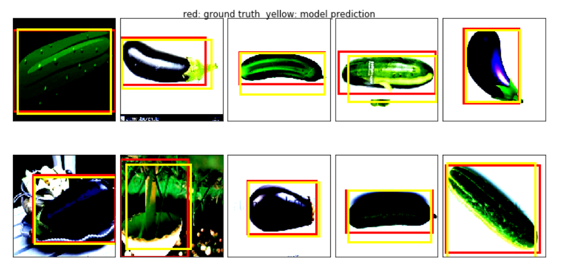

# BBOX
Simple image classification and localization pytorch code with vegetable data set
## Network architecture
  - I used part VGG16 pre-trained network features in the front and added my classification and boundingbox network at the end
  - There are 3 different vegetable catagories
## contents
  - training and validation jupyter notebook : vege_bbox.ipynb
  - training data 
    - I used data set from 
    [Object-Classification-and-Localization-with-TensorFlow](https://github.com/MuhammedBuyukkinaci/Object-Classification-and-Localization-with-TensorFlow.git)
    - Becasue of limitted data set, I did simple image agumentation to increase dataset and borrowed somw cv2 image trasformation code
    [aakanksha](https://jovian.ml/aakanksha-ns)
  - sample data
    - I made vege_example folder for testing
  - pre trained model file: sim_bbox_final.pth
## output example  
  
